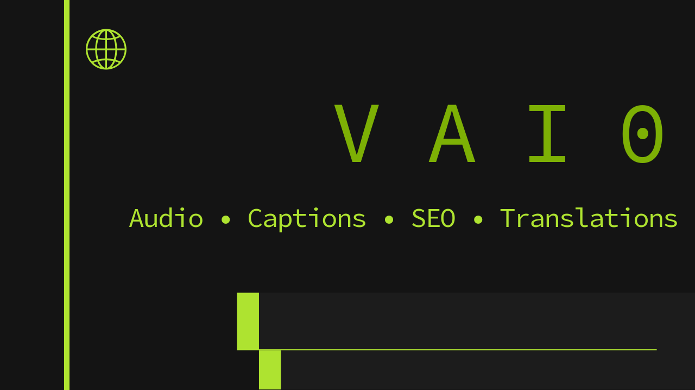

<p align="center">
  
</p>

<h1 align="center">🎬 VAI0 — Video Auto Intelligence Operator</h1>

<p align="center">
  <b>🎧 Audio • 💬 Captions • 📝 SEO • 🌐 Translations</b><br>
  End-to-end AI automation for video processing and multilingual SEO optimization.
</p>

**VAI0** (Video Auto Intelligence Operator) is an end-to-end CLI workflow that converts your raw videos into multilingual, SEO-optimized YouTube assets — including **captions**, **titles**, and **descriptions** — ready for global publishing.

---

## ✨ Features

| Stage                           | Description                                                                  |
| ------------------------------- | ---------------------------------------------------------------------------- |
| 🎧**Audio Extraction**    | Extracts `.mp3` from your video using FFmpeg.                              |
| 💬**Caption Generation**  | Transcribes or translates audio to `.srt` via Whisper.                     |
| 📝**TD Generation**       | Builds an SEO-optimized**Title + Description (TD)** file using Ollama. |
| 🌐**TD Translation**      | Localizes TDs into multiple target languages with cultural adaptation.       |
| 💬**Caption Translation** | Produces synchronized `.srt` subtitles in all supported languages.         |
| ⚙️**Auto Resume**       | Keeps track of your progress in `.vaio.json`, enabling `vaio continue`.  |

---

## ⚙️ Installation

### 1️⃣ Clone the Repository

```bash
git clone https://github.com/number16busshelter/vaio.git
cd vaio
```

### 2️⃣ Create a Virtual Environment

It’s strongly recommended to isolate VAI0’s dependencies.

```bash
python3 -m venv .venv
source .venv/bin/activate   # (Windows: .venv\Scripts\activate)
```

### 3️⃣ Install Dependencies

```bash
pip install -r requirements.txt
```

Or minimal manual install:

```bash
pip install ffmpeg-python openai-whisper ollama rich
```

---

## 🧰 System Requirements

| Dependency                  | Purpose                  | Install                                                             |
| --------------------------- | ------------------------ | ------------------------------------------------------------------- |
| **FFmpeg**            | Audio extraction         | [Download](https://ffmpeg.org/download.html)or `brew install ffmpeg` |
| **Whisper**           | Speech-to-text model     | `pip install openai-whisper`                                      |
| **Ollama**            | Local LLM runtime        | [Install Ollama](https://ollama.ai/download)                           |
| **VS Code**(optional) | Auto-opens generated TDs | [VS Code](https://code.visualstudio.com/)                              |

Confirm installation:

```bash
vaio check
```

Expected output:

```
FFmpeg: ✅ OK
Whisper: ✅ OK
Ollama: ✅ OK
Meta file access: ✅ OK
```

---

## 🧩 Installation as a CLI Tool

You can install `vaio` globally to call it from anywhere:

```bash
chmod +x cli.py
sudo ln -s $(pwd)/cli.py /usr/local/bin/vaio
```

Now test:

```bash
vaio --version
```

Output:

```
VAIO v1.0.0 - By AXID
```

---

## ⚡ Quick Start

```bash
vaio ./MyVideo.mp4
```

VAIO automatically performs:

```
🎧 Audio extraction → 💬 Captioning → 📝 TD generation → 🌐 Translation → 💬 Caption translation
```

All outputs are stored beside the video.

---

## 🧭 Command Reference

| Command                    | Purpose                               |
| -------------------------- | ------------------------------------- |
| `vaio audio <video>`     | Extract audio & generate captions     |
| `vaio desc <video>`      | Create SEO title + description        |
| `vaio translate <video>` | Translate TDs into multiple languages |
| `vaio captions <video>`  | Translate `.srt`subtitles           |
| `vaio continue <video>`  | Resume from the last known stage      |
| `vaio check`             | Run environment diagnostics           |

---

## 📁 Directory Layout

```
MyVideo.mp4
├── MyVideo.mp3
├── captions/
│   ├── MyVideo.es.srt
│   ├── MyVideo.en.srt
│   └── ...
├── description/
│   ├── td.es.txt
│   ├── td.en.txt
│   └── ...
└── MyVideo.vaio.json
```

---

## 🧠 Configuration

All constants are defined in `vaio/core/constants.py`:

```python
SOURCE_LANGUAGE = "Spanish"
TARGET_LANGUAGES = {
    "en": "English",
    "es": "Spanish",
    "fr": "French",
    "de": "German",
    "ja": "Japanese",
    "zh": "Chinese",
}
WHISPER_MODEL = "large-v3-turbo"
OLLAMA_MODEL = "gpt-oss"
```

---

## 🧩 Example Workflow

```bash
vaio ./MyVideo.mov
```

Output:

```
🎧 Extracting audio → MyVideo.mp3
🧠 Generating captions using Whisper...
✅ Captions saved → captions/MyVideo.es.srt
🧠 Generating SEO title & description...
✅ TD generated → description/td.es.txt
🌐 Translating TD into 8 languages...
✅ Caption translation complete.
✅ All stages finished!
```

---

## 🧑‍💻 Developer Setup

### Optional VS Code Launch Configuration

Create `.vscode/launch.json`:

```json
{
  "version": "0.2.0",
  "configurations": [
    {
      "name": "Run VAI0 CLI",
      "type": "python",
      "request": "launch",
      "program": "cli.py",
      "args": ["./MyVideo.mp4"],
      "console": "integratedTerminal"
    }
  ]
}
```

### Running Tests

You can simulate each stage manually:

```bash
vaio audio ./test.mp4
vaio desc ./test.mp4 --template-file td_temp.txt
vaio translate ./test.mp4
vaio captions ./test.mp4
```

---

## 🧾 License

**MIT License © 2025 AXID.ONE**

---

### 🧱 Built With

* [FFmpeg](https://ffmpeg.org)
* [Whisper](https://github.com/openai/whisper)
* [Ollama](https://ollama.ai)
* [Rich](https://github.com/Textualize/rich)

---

Would you like me to include a **Dockerfile** example (for deploying VAI0 as a containerized CLI) in this README as the next step?

It would allow instant `docker run -v $(pwd):/app vaio ./video.mp4` usage on any system.
